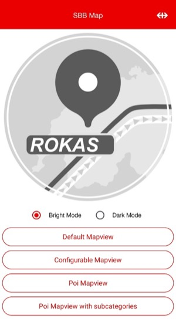
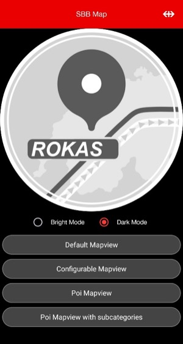
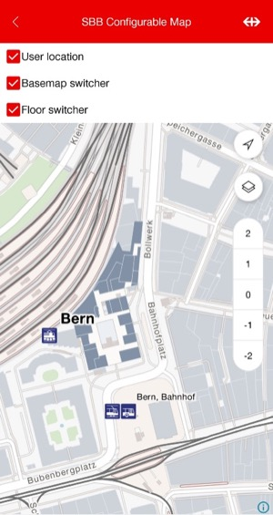
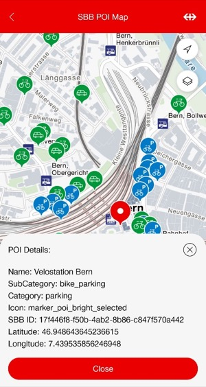
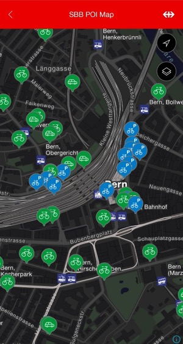
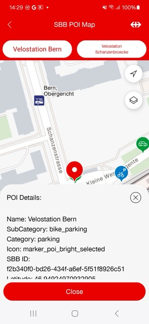
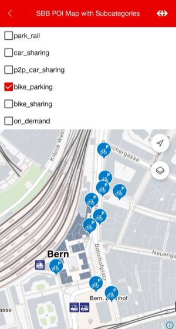
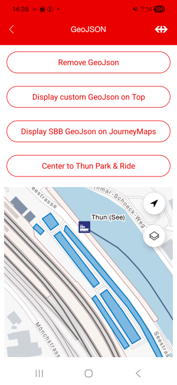

# Journey Maps Client for Android

This android SDK allows you to easily incorporate SBB maps into your Android application.




## Maintainers

- [Yoonjoo Lee](https://github.com/Lee-Yoonjoo)

## Supported platforms


## Precondition

### Internal Use

As this is an SBB internal package, ensure that your build agent has access to this repository.

### Technology Stack

The SBB Journey Maps Client is built with [Jetpack Compose](https://developer.android.com/jetpack/compose), ensuring seamless compatibility and a modern UI toolkit that enhances both the design and functionality of your application. For optimal integration and performance, we recommend developing your application using Jetpack Compose.

### Technical Requirements

Please ensure your project meets the following minimum SDK requirements:

```gradle
compileSdk 36
minSdk 24
```

## Setup

### Adding the package to your application

```gradle
dependencies {
    // Your other dependencies
    ...
        implementation 'ch.sbb.maps:android-sdk:<VERSION>' //latest version 2.0.0
    ..
}
```

This will get you latest changes from the `master` branch. Replace this with a more recent
`release tag` to get a more stable version.

### Accessing ROKAS styles & datasources

You need to get an **API key** to access the Map Tile Server and the style provided by ROKAS.
To do so, register your application on [SBB API Platform](https://developer.sbb.ch/apis/journey-maps-tiles/information)

For testing purposes only, you may use the key included in the Angular Client example on
[angular.app.sbb.ch](https://angular.app.sbb.ch/journey-maps/components/angular/examples).
Please be aware that this **key may be revoked at any time**.

Do not forget to provide an api key, in `local.properties` in your android project,
`local.properties` should be excluded from version control by default. Do not commit it.

```
JOURNEY_MAPS_DEMO_API_KEY = "<YOUR-API-KEY>"
```

## Usage

### SBBMapView

To utilize `DefaultMapView`, simply pass in a `tilesApiKey` for map tiles access. Default functionalities are set to true.

```kotlin
@Composable
fun DefaultMapView() {
    SBBMapView(tilesApiKey = "your_api_key_here")
}
```

The `ConfigurableMapView` function is a composable that displays a configurable map view. You can enable or disable user location, map style switch, and floor switch.
It also takes an API key for the map tiles as an argument.

```kotlin
@Composable
fun ConfigurableMapView() {
    // To disable each functionality, set it false.
    SBBMapView(
        tilesApiKey = "your_api_key_here",
        controls = SBBMapControls(
            userLocationEnabled = false,
            mapStyleSwitchEnabled = false,
            floorSwitchEnabled = false,
        ),
    )
}
```



### SBBMapView with POI

This code defines a `PoiMapView` composable that displays a map view with Points of Interest (POIs) functionality.

Callback functions are triggered when the user taps the map (`onMapClick`) or a POI (`onPoiClick`).

- `onMapClick` receives a `LatLng` for the tapped location.
- `onPoiClick` receives a `Feature` representing the selected POI.

You can implement your own handling using the supplied `LatLng` or `Feature`.

```kotlin
@Composable
fun PoiMapView() {
    // ...
    val selectedPoi = remember { mutableStateOf<Feature?>(null) }
    val clickedPoint = remember { mutableStateOf<LatLng?>(null) }
    val newCoordinates = remember { MutableLiveData(LatLng(46.94881863, 7.43913775)) }
    val zoomLevel = remember { MutableLiveData<Double>(17.0) }

    SBBMapView(
        tilesApiKey = tilesApiKey,
        cameraPosition = cameraPositionForBern,
        centerTo = newCoordinates,
        zoomLevel = zoomLevel,
        controls = SBBMapControls(
            floorSwitchEnabled = false,
        ),
        poi = SBBMapPoi(
            enabled = true,
            selectedPoi = selectedPoi,
            subcategories = selectedPoiSubcategories,
        ),
        callbacks = SBBMapCallbacks(
            onCameraIdle = {
                selectedPoi.value = null
                clickedPoint.value = null
            },
            onMapClick = { latLng ->
                clickedPoint.value = latLng
                selectedPoi.value = null
            },
            onPoiClick = { feature ->
                selectedPoi.value = feature
                clickedPoint.value = null
            },
        ),
    )
}
```





### SBBMapView with POI Subcategories

The `PoiMapView` composable also supports filtering POIs by subcategory.

```kotlin
@Composable
fun PoiMapView() {
    // ...
    val selectedPoiSubcategories = remember {
        MutableLiveData(DEFAULT_POI_FILTER_SUB_CATEGORIES)
    }
    val selectedPoi = remember { mutableStateOf<Feature?>(null) }

    SBBMapView(
        // ...
        poi = SBBMapPoi(
            enabled = true,
            selectedPoi = selectedPoi,
            subcategories = selectedPoiSubcategories,
        ),
        // ...
    )
}

// Available subcategories of poi filter via SBBPoiCategoryType enum.
val DEFAULT_POI_FILTER_SUB_CATEGORIES = listOf(
    SBBPoiCategoryType.PARK_RAIL.value,
    SBBPoiCategoryType.CAR_SHARING.value,
    SBBPoiCategoryType.P2P_CAR_SHARING.value,
    SBBPoiCategoryType.BIKE_PARKING.value,
    SBBPoiCategoryType.BIKE_SHARING.value,
    SBBPoiCategoryType.ON_DEMAND.value,
)
```



### POIs: GeoJSON (POIs Areas)

You can render external POI areas by passing a GeoJSON FeatureCollection into the SDK. The expected geometry is typically MultiPolygon and each feature may include properties such as a category string used by your style.

```kotlin
@Composable
fun GeoJsonMapView(tilesApiKey: String) {
    // default without polygon
    val geoJsonState = remember { MutableLiveData(SBBGeoJson.EMPTY) }

    // example : polygon with GeoJSON sample
    geoJsonState.value = SBBGeoJson(GeoJsonSamples.thunParkRideParking)

    // example : polygon with GeoJson and customized colors
    geoJsonState.value = SBBGeoJson(
        geoJson = GeoJsonSamples.thunParkRideParking,
        fillColor = Color.BLUE,
        lineColor = Color.RED,
        lineWidth = 3,
    )

    SBBMapView(
        // ...
        controls = SBBMapControls(
            floorSwitchEnabled = false,
        ),
        poi = SBBMapPoi(
            enabled = true,
            geoJson = geoJsonState,
        ),
        // ...
    )
}
```

- The convenience factory `SBBGeoJson(geoJsonString)` by default writes into the `journey-pois-areas-source` used by the Journey Maps style. Override `sourceId` to target a different source id.
- Features should be a FeatureCollection (MultiPolygon) and may include a category property (String) if your style expects it.



## Features

| Feature                                 | Android |
|-----------------------------------------|---------|
| Map Styles (bright, dark and Satellite) | ✅       |
| Camera                                  | ✅       |
| Gesture                                 | ✅       |
| Location                                | ✅       |
| Customizable UI                         | ✅       |
| Floor Switcher (switch levels)          | ✅       |
| POIs: Display                           | ✅       |
| POIs: Event Triggering and Select       | ✅       |
| POIs: Subcategories                     | ✅       |
| POIs: GeoJSON (POIs Areas)              | ✅       |

## Example App

### SBB Journey Maps

